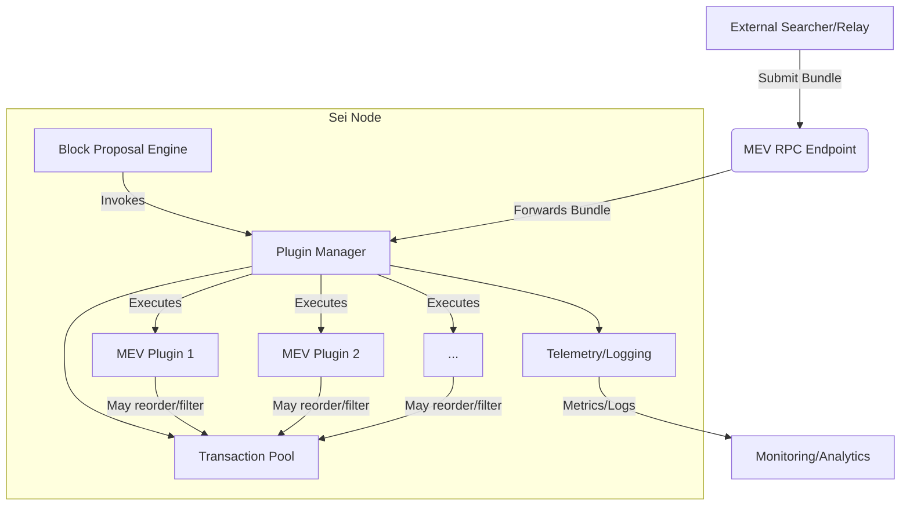

import { Callout } from 'nextra/components';

# MEV on Sei

## Introduction

Maximal Extractable Value (MEV) is a central force in blockchain economics. It determines how transactions are ordered, how blocks are composed, and how incentives are distributed among validators and searchers. While many networks treat MEV as a risk to be minimized, Sei treats it as a programmable, auditable part of the protocol. The MEV system is designed to make extraction explicit, configurable, and observable.

Sei's MEV system is designed for:

- **Parallelized EVM:** Supports high-throughput MEV strategies with efficient transaction processing.
- **Instant Finality:** MEV outcomes are deterministic and available immediately after block inclusion.
- **Open Plugin Ecosystem:** Any developer can build, audit, and deploy MEV plugins.
- **Operational Transparency:** Plugins are observable via logs and metrics, and node operators can manage them without protocol changes.
- **Extensibility:** The system is designed for future enhancements, including plugin versioning and hot-reloading.

### Intended Users

- **Validators:** Can implement and operate custom MEV strategies to optimize block rewards and transaction flow.
- **Searchers:** Can submit bundles directly to nodes running compatible plugins.
- **dApp Developers:** Can build applications that interact with or leverage MEV plugins.
- **Infrastructure Providers:** Can offer monitoring, analytics, and plugin management services.

## System Architecture

Sei's MEV system is a modular extension to the block production pipeline. It enables node operators to load custom plugins that participate in transaction ordering and bundle processing. The architecture is designed for extensibility, operational transparency, and high throughput.

<Callout type="info">The diagram below illustrates the flow of bundles and data through the Sei MEV system, including external actors, the MEV RPC endpoint, plugin orchestration, transaction pool, and telemetry/monitoring.</Callout>

### Component Breakdown

The **Block Proposal Engine** is the core of block production. At defined stages, it triggers the plugin manager to allow MEV logic to participate in transaction selection and ordering.

The **Plugin Manager** discovers, loads, and manages all registered MEV plugins. It coordinates plugin execution, ensuring each plugin receives the correct context and data at each lifecycle stage.

**MEV Plugins** are user-defined Go modules that implement the MEV Plugin Interface. Each plugin can inspect, reorder, or filter transactions, and can accept or reject bundles submitted via RPC. Multiple plugins can be loaded simultaneously, and their effects are composed by the plugin manager.

The **Transaction Pool** is the set of candidate transactions for block inclusion. Plugins can modify the contents or order of this pool before block finalization.

The **MEV RPC Endpoint** is an HTTP interface that allows external actors (searchers, relays) to submit bundles or query plugin status. Bundles submitted here are forwarded to the plugin manager for processing.

**Telemetry and Logging** are integrated for operational transparency. All plugin actions, bundle submissions, and transaction modifications are observable for monitoring and analytics.

## Plugin Lifecycle

The MEV plugin lifecycle in Sei is designed to provide clear, auditable stages for plugin operation. Each stage is invoked by the plugin manager at the appropriate time in the block production process.

  

    
1

    
Registration

  

  

    
2

    
Initialization

  

  

    
3

    
Bundle Submission

  

  

    
4

    
Block Proposal

  

  

    
5

    
Telemetry & Logging

  

  

    
6

    
Shutdown

  

1. **Registration:** At node startup, the plugin manager scans for available plugins based on configuration or CLI flags. Each plugin is loaded and registered with the manager.
2. **Initialization:** The plugin manager calls each plugin's initialization method, providing configuration and context. Plugins can allocate resources, load parameters, or establish connections as needed.
3. **Bundle Submission:** When an external actor submits a bundle via the MEV RPC endpoint, the plugin manager forwards the bundle to all registered plugins. Each plugin can validate, accept, or reject the bundle based on custom logic. Accepted bundles are added to the transaction pool for consideration during block proposal.
4. **Block Proposal:** During block proposal, the plugin manager invokes each plugin's block proposal hook. Plugins can inspect the transaction pool, reorder or filter transactions, and inject new transactions if required. The final transaction order is determined after all plugins have executed.
5. **Telemetry and Logging:** Throughout operation, plugins emit logs and metrics. These are collected by the node and made available for monitoring and analytics. All bundle submissions, transaction modifications, and plugin actions are recorded for auditability.
6. **Shutdown:** On node shutdown, the plugin manager calls each plugin's shutdown method. Plugins can release resources, flush state, or perform cleanup tasks as needed.

## Integration Points

Sei's MEV system exposes several integration points for developers and operators:

- **Block Proposal:** Plugins can reorder, filter, or inject transactions during block proposal.
- **Bundle Submission:** Plugins can accept and validate MEV bundles via RPC.
- **Telemetry/Logging:** Plugins can emit custom metrics and logs for monitoring and analytics.
