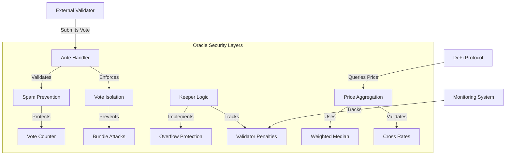

import { Callout } from 'nextra/components';

# Oracle Security & Spam Prevention

## Introduction

Sei's Oracle system is the backbone of DeFi price discovery on the network. While oracles enable critical financial operations, they also present unique security challenges. This guide provides a comprehensive analysis of Sei's multi-layered security architecture designed to ensure reliable, manipulation-resistant price feeds.

The Oracle security system is designed for:

- **Spam Prevention:** Block-height based vote limiting with mutex protection
- **Vote Isolation:** Enforced transaction isolation to prevent MEV manipulation
- **Overflow Protection:** Safe arithmetic operations and bounds validation
- **Validator Accountability:** Performance tracking with slashing for poor participation
- **Attack Resistance:** Multiple layers of defense against common oracle attacks

### Intended Audience

- **Validators:** Understanding security requirements for oracle participation
- **DeFi Developers:** Building applications with secure price feed integration
- **Security Researchers:** Analyzing and improving oracle security mechanisms
- **Node Operators:** Implementing best practices for oracle operations

## Security Architecture

Sei's Oracle security is implemented through multiple complementary layers, each addressing specific attack vectors while maintaining high performance and reliability.



## Spam Prevention System

The Oracle implements a sophisticated spam prevention system that ensures each validator can only submit one vote per block, preventing vote flooding attacks.

### Core Implementation

```go
// From x/oracle/keeper/keeper.go
func (k Keeper) CheckAndSetSpamPreventionCounter(
    ctx sdk.Context,
    validatorAddr sdk.ValAddress
) error {
    // Thread-safe mutex per validator
    mtx, _ := k.spamPreventionCounterMtxMap.LoadOrStore(
        validatorAddr.String(),
        &sync.Mutex{}
    )
    mtx.Lock()
    defer mtx.Unlock()

    // Check if validator already voted this block
    if k.getSpamPreventionCounter(ctx, validatorAddr) == ctx.BlockHeight() {
        return sdkerrors.Wrap(
            sdkerrors.ErrAlreadyExists,
            fmt.Sprintf("the validator has already submitted a vote at the current height=%d",
                ctx.BlockHeight())
        )
    }

    // Mark validator as having voted
    k.setSpamPreventionCounter(ctx, validatorAddr)
    return nil
}
```

### Key Security Features

<div className="grid grid-cols-4 gap-4 my-8">
  <div className="col-span-1 flex flex-col">
    <div className="bg-blue-900 text-white rounded p-4 mb-2">
      <div className="font-bold mb-2">Height-Based Tracking</div>
      <div className="text-sm">Uses block height as a natural counter, automatically resetting each block</div>
    </div>
  </div>
  <div className="col-span-1 flex flex-col">
    <div className="bg-blue-900 text-white rounded p-4 mb-2">
      <div className="font-bold mb-2">Mutex Protection</div>
      <div className="text-sm">Thread-safe concurrent access prevents race conditions</div>
    </div>
  </div>
  <div className="col-span-1 flex flex-col">
    <div className="bg-blue-900 text-white rounded p-4 mb-2">
      <div className="font-bold mb-2">Transient Storage</div>
      <div className="text-sm">Uses memory store for efficiency, no persistent state needed</div>
    </div>
  </div>
  <div className="col-span-1 flex flex-col">
    <div className="bg-blue-900 text-white rounded p-4 mb-2">
      <div className="font-bold mb-2">Ante Handler Integration</div>
      <div className="text-sm">Enforced at transaction validation level</div>
    </div>
  </div>
</div>

### Ante Handler Enforcement

The spam prevention is enforced at the ante handler level, ensuring votes are validated before entering the mempool:

```go
// From x/oracle/ante.go
type SpammingPreventionDecorator struct {
    oracleKeeper keeper.Keeper
}

func (spd SpammingPreventionDecorator) AnteHandle(
    ctx sdk.Context,
    tx sdk.Tx,
    simulate bool,
    next sdk.AnteHandler
) (newCtx sdk.Context, err error) {
    // Skip during re-check
    if ctx.IsReCheckTx() {
        return next(ctx, tx, simulate)
    }

    // Validate during CheckTx
    if !simulate && ctx.IsCheckTx() {
        err := spd.CheckOracleSpamming(ctx, tx.GetMsgs())
        if err != nil {
            return ctx, err
        }
    }

    return next(ctx, tx, simulate)
}
```

## Vote Isolation

Oracle votes must be submitted in isolated transactions to prevent manipulation through transaction bundling.

### Transaction Isolation Enforcement

```go
// From x/oracle/ante.go
type VoteAloneDecorator struct{}

func (VoteAloneDecorator) AnteHandle(
    ctx sdk.Context,
    tx sdk.Tx,
    simulate bool,
    next sdk.AnteHandler
) (newCtx sdk.Context, err error) {
    oracleVote := false
    otherMsg := false

    // Check all messages in transaction
    for _, msg := range tx.GetMsgs() {
        switch msg.(type) {
        case *types.MsgAggregateExchangeRateVote:
            oracleVote = true
        case *types.MsgDelegateFeedConsent:
            oracleVote = true
        default:
            otherMsg = true
        }
    }

    // Reject if oracle vote is bundled with other messages
    if oracleVote && otherMsg {
        return ctx, sdkerrors.Wrap(
            sdkerrors.ErrInvalidRequest,
            "oracle votes cannot be in the same tx as other messages"
        )
    }

    return next(ctx, tx, simulate)
}
```

### Security Benefits

- **MEV Prevention**: Votes cannot be bundled with trading transactions
- **Simplified Validation**: Each vote transaction stands alone
- **Reduced Attack Surface**: No cross-message dependencies to exploit
- **Delegation Support**: Feed consent messages also require isolation

## Input Validation & Protection

The Oracle system implements comprehensive input validation to prevent malformed data and ensure reliable price calculations.

### Exchange Rate Parsing

```go
// From x/oracle/types/vote.go
func ParseExchangeRateTuples(tuplesStr string) (ExchangeRateTuples, error) {
    tuplesStr = strings.TrimSpace(tuplesStr)
    if len(tuplesStr) == 0 {
        return nil, nil
    }

    tupleStrs := strings.Split(tuplesStr, ",")
    tuples := make(ExchangeRateTuples, len(tupleStrs))
    duplicateCheckMap := make(map[string]bool)

    for i, tupleStr := range tupleStrs {
        // Uses Cosmos SDK's built-in decimal validation
        decCoin, err := sdk.ParseDecCoin(tupleStr)
        if err != nil {
            return nil, err
        }

        // Prevent duplicate denoms in single vote
        if _, ok := duplicateCheckMap[decCoin.Denom]; ok {
            return nil, fmt.Errorf("duplicated denom %s", decCoin.Denom)
        }

        tuples[i] = ExchangeRateTuple{
            Denom:        decCoin.Denom,
            ExchangeRate: decCoin.Amount,
        }
        duplicateCheckMap[decCoin.Denom] = true
    }

    return tuples, nil
}
```

### Validation Features

- **Decimal Precision**: Uses Cosmos SDK's `sdk.Dec` type with built-in overflow protection
- **Format Validation**: Ensures exchange rates follow DecCoin format (e.g., "123.45uatom")
- **Duplicate Prevention**: Rejects votes with duplicate denoms
- **Abstain Support**: Allows zero values for abstaining from specific denoms

## Validator Penalties

The Oracle tracks validator performance to ensure reliable price feeds through economic incentives.

### Performance Tracking

```go
type VotePenaltyCounter struct {
    MissCount    uint64  // Validator didn't vote
    AbstainCount uint64  // Validator abstained
    SuccessCount uint64  // Successful votes
}
```

### Slashing Mechanism

Validators face penalties for poor oracle participation:

1. **Miss Penalty**: Applied when validators fail to submit required votes
2. **Abstain Penalty**: Applied for submitting empty votes
3. **Slash Window**: Rolling window for penalty calculation

<Callout type="warning">Validators with miss rates exceeding the threshold face slashing penalties. Monitor your oracle participation rate to avoid penalties.</Callout>

## Attack Vectors & Mitigations

### 1. Vote Flooding Attack

**Attack Vector**: Spamming multiple votes to manipulate the median price

**Mitigation Strategy**:

- One vote per validator per block enforced by spam counter
- Height-based tracking with automatic reset
- Mutex protection prevents race conditions

### 2. Bundle Attack

**Attack Vector**: Bundling oracle votes with trading transactions for MEV extraction

**Mitigation Strategy**:

- Strict vote isolation requirement
- Ante handler validation before mempool entry
- Separate transaction validation pipeline

### 3. Price Manipulation

**Attack Vector**: Submitting extreme prices to skew the weighted median

**Mitigation Strategy**:

- Weighted median calculation reduces impact of outliers
- Exchange rate bounds validation
- Cross-rate consistency checks

### 4. Timing Attack

**Attack Vector**: Exploiting vote timing to front-run price movements

**Mitigation Strategy**:

- Fixed voting windows per round
- Aggregate vote mechanism with reveal phase
- TWAP calculations for critical operations

## Best Practices for Validators

### Reliable Price Feed Configuration

```yaml
# oracle-feeder.yaml
oracle:
  sources:
    - name: binance
      weight: 0.3
      timeout: 3s
    - name: coinbase
      weight: 0.3
      timeout: 3s
    - name: kraken
      weight: 0.4
      timeout: 3s
  aggregation: weighted_median
  fallback_threshold: 2 # Minimum sources required
```

### Monitoring Implementation

```go
// Monitor oracle participation health
func MonitorOracleHealth(validator sdk.ValAddress) {
    counter := GetVotePenaltyCounter(validator)

    totalVotes := counter.MissCount + counter.AbstainCount + counter.SuccessCount
    if totalVotes == 0 {
        return // No votes to analyze
    }

    missRate := float64(counter.MissCount) / float64(totalVotes)

    if missRate > 0.1 { // 10% miss rate threshold
        AlertHighMissRate(validator, missRate)
    }
}
```

### Feeder Delegation Setup

```go
// Delegate oracle voting to dedicated feeder account
msg := &types.MsgDelegateFeedConsent{
    Operator: validatorAddr,
    Delegate: feederAddr,
}
```

## Integration Guidelines for DeFi Protocols

### Price Feed Best Practices

<Callout type="info">Always implement multiple layers of price validation in your DeFi protocols: 1. Use TWAP for liquidation calculations 2. Implement staleness checks 3. Handle missing prices gracefully 4. Validate price ranges</Callout>

### Secure Integration Pattern

```solidity
contract SecureOracleConsumer {
    uint256 constant PRICE_STALENESS_THRESHOLD = 60; // seconds
    uint256 constant MIN_TWAP_PERIOD = 300; // 5 minutes

    function getLiquidationPrice(address asset) external view returns (uint256) {
        // Use TWAP for liquidations
        uint256 twapPrice = oracle.getOracleTwaps(asset, MIN_TWAP_PERIOD);

        // Check price staleness
        uint256 lastUpdate = oracle.getLastUpdateTime(asset);
        require(block.timestamp - lastUpdate < PRICE_STALENESS_THRESHOLD, "Stale price");

        // Validate price range
        require(twapPrice > 0 && twapPrice < type(uint256).max / 2, "Invalid price");

        return twapPrice;
    }
}
```

## Monitoring & Alerts

### Key Metrics to Track

- **Participation Rate**: Percentage of validators submitting votes
- **Price Deviation**: Standard deviation between validator submissions
- **Update Frequency**: Blocks between successful price updates
- **Miss Rate**: Per-validator miss percentage over time

### Alert Configuration

```yaml
# monitoring-config.yaml
alerts:
  oracle_participation:
    warning_threshold: 80%
    critical_threshold: 60%
    check_interval: 5m

  price_deviation:
    warning_threshold: 5%
    critical_threshold: 10%
    check_interval: 1m

  update_lag:
    warning_blocks: 10
    critical_blocks: 20
    check_interval: 30s
```

## Related Resources

- [Oracle System Overview](/learn/oracles)
- [Oracle Precompile Guide](/evm/precompiles/oracle)
