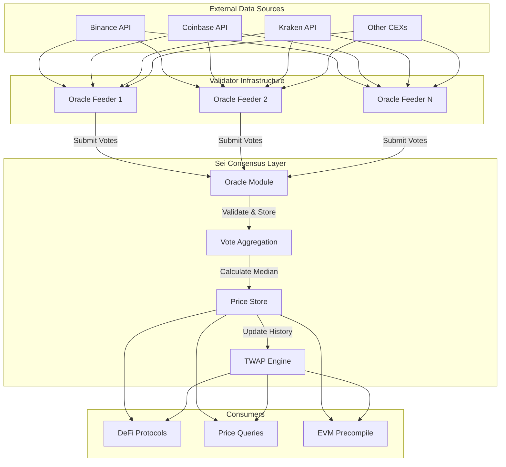

import { AppCardsGridCategory } from '../../src/components';
import { Callout } from 'nextra/components';

# Oracle System on Sei

## Introduction

Oracles are the bridge between blockchain networks and real-world data. On Sei, the native oracle module provides a decentralized, secure, and efficient mechanism for bringing off-chain price data on-chain. Unlike third-party oracle solutions, Sei's native oracle is deeply integrated into the consensus layer, making it a critical component of the network's infrastructure.

Sei's Oracle system is designed for:

- **Validator Participation:** All validators are expected to participate in price voting as part of their duties
- **High Frequency Updates:** Price updates occur every block through an efficient voting mechanism
- **Weighted Aggregation:** Uses stake-weighted median calculations to resist manipulation
- **Time-Weighted Averages:** Built-in TWAP support for DeFi protocols requiring smoothed prices
- **Spam Resistance:** Multiple security layers prevent vote manipulation and overflow attacks

### Intended Users

- **Validators:** Must run oracle feeders to submit price votes and maintain good standing
- **DeFi Developers:** Can query real-time prices and TWAPs for liquidations and trading
- **dApp Builders:** Access reliable price feeds for any on-chain application
- **Infrastructure Providers:** Can build enhanced oracle services on top of the native module

## System Architecture

The Oracle system operates as a core module within Sei's consensus mechanism. Validators submit price votes that are aggregated each block to produce reliable exchange rates.



### Component Breakdown

**Oracle Feeders** are off-chain services run by validators that fetch prices from multiple exchanges, aggregate them locally, and submit votes to the chain. Each validator typically runs their own feeder with custom logic.

**Vote Submission** occurs through `MsgAggregateExchangeRateVote` transactions. Validators must submit votes for all whitelisted denoms each voting period or face penalties.

**Vote Aggregation** happens at the end of each voting period (typically every block). The module calculates a stake-weighted median of all valid votes to determine the final exchange rate.

**Price Store** maintains the current exchange rates and historical data needed for TWAP calculations. Prices are stored with block height timestamps for auditability.

**TWAP Engine** calculates time-weighted average prices over configurable lookback periods. This provides smoothed prices that are resistant to short-term manipulation.

## Voting Mechanism

The Oracle voting process uses direct vote submission with aggregation at the end of each voting period to ensure reliable price discovery.

<div className="grid grid-cols-5 gap-4 my-8">
  <div className="col-span-1 flex flex-col items-center">
    <div className="bg-blue-900 text-white rounded-full w-10 h-10 flex items-center justify-center font-bold mb-2">1</div>
    <div className="text-center text-xs">Price Collection</div>
  </div>
  <div className="col-span-1 flex flex-col items-center">
    <div className="bg-blue-900 text-white rounded-full w-10 h-10 flex items-center justify-center font-bold mb-2">2</div>
    <div className="text-center text-xs">Local Aggregation</div>
  </div>
  <div className="col-span-1 flex flex-col items-center">
    <div className="bg-blue-900 text-white rounded-full w-10 h-10 flex items-center justify-center font-bold mb-2">3</div>
    <div className="text-center text-xs">Vote Submission</div>
  </div>
  <div className="col-span-1 flex flex-col items-center">
    <div className="bg-blue-900 text-white rounded-full w-10 h-10 flex items-center justify-center font-bold mb-2">4</div>
    <div className="text-center text-xs">Aggregation</div>
  </div>
  <div className="col-span-1 flex flex-col items-center">
    <div className="bg-blue-900 text-white rounded-full w-10 h-10 flex items-center justify-center font-bold mb-2">5</div>
    <div className="text-center text-xs">Price Update</div>
  </div>
</div>

1. **Price Collection:** Oracle feeders continuously fetch prices from configured exchanges
2. **Local Aggregation:** Feeders apply their own logic to aggregate prices (median, weighted average, etc.)
3. **Vote Submission:** Aggregated prices are submitted on-chain as validator votes
4. **Aggregation:** The oracle module calculates stake-weighted median of all votes
5. **Price Update:** New exchange rates are stored and made available for queries

## Oracle Providers

While Sei has a powerful native oracle, the ecosystem also supports third-party oracle providers for specialized use cases:

<AppCardsGridCategory category="oracle" />

## Querying Oracle Data

### Active Denoms

Query the currently supported assets with exchange rate feeds:

```bash
seid q oracle actives
```

Example response:

```yaml
actives:
  - uatom
  - ubtc
  - ueth
  - usei
```

### Current Exchange Rates

Get the latest exchange rates for all supported assets:

```bash
seid q oracle exchange-rates
```

Example response:

```yaml
- denom: uatom
  oracle_exchange_rate:
    exchange_rate: '10.813741474077133110'
    last_update: '7809045'
- denom: ubtc
  oracle_exchange_rate:
    exchange_rate: '28378.473894707711800815'
    last_update: '7806841'
```

### Time-Weighted Average Prices (TWAP)

Query TWAP for a specific lookback period:

```bash
seid q oracle twaps $LOOKBACK_SECONDS
```

Example with 300-second (5-minute) lookback:

```yaml
oracle_twaps:
  - denom: uatom
    lookback_seconds: '300'
    twap: '10.820090685543308091'
  - denom: ubtc
    lookback_seconds: '300'
    twap: '28356.159567933482758461'
```

### Oracle Parameters

View the current oracle module configuration:

```bash
seid q oracle params
```

Example response:

```yaml
params:
  lookback_duration: '3600'
  min_valid_per_window: '0.050000000000000000'
  reward_band: '0.020000000000000000'
  slash_fraction: '0.000000000000000000'
  slash_window: '201600'
  vote_period: '2'
  vote_threshold: '0.667000000000000000'
  whitelist:
    - name: uatom
    - name: ueth
```

Key parameters include:

- `vote_period`: How often votes are aggregated (default: 2 blocks)
- `vote_threshold`: Minimum voting power required for valid price (default: 66.7%)
- `reward_band`: Acceptable deviation from weighted median for rewards (default: 2%)
- `slash_window`: Period for calculating miss rates (default: 201,600 blocks ≈ 2 days)
- `min_valid_per_window`: Minimum participation rate to avoid slashing (default: 5%)
- `lookback_duration`: Maximum TWAP lookback period (default: 3,600 seconds)

## Integration Patterns

### For Smart Contracts

Access oracle prices through the EVM precompile:

```solidity
interface IOracle {
    struct OracleExchangeRate {
        string exchangeRate;
        string lastUpdate;
        int64 lastUpdateTimestamp;
    }

    struct DenomOracleExchangeRatePair {
        string denom;
        OracleExchangeRate oracleExchangeRateVal;
    }

    struct OracleTwap {
        string denom;
        string twap;
        int64 lookbackSeconds;
    }

    function getExchangeRates() external view returns (DenomOracleExchangeRatePair[] memory);
    function getOracleTwaps(uint64 lookbackSeconds) external view returns (OracleTwap[] memory);
}

contract PriceConsumer {
    IOracle constant oracle = IOracle(0x0000000000000000000000000000000000001008);

    function getPrice(string memory denom) external view returns (string memory) {
        IOracle.DenomOracleExchangeRatePair[] memory rates = oracle.getExchangeRates();

        for (uint i = 0; i < rates.length; i++) {
            if (keccak256(bytes(rates[i].denom)) == keccak256(bytes(denom))) {
                return rates[i].oracleExchangeRateVal.exchangeRate;
            }
        }
        revert("Denom not found");
    }
}
```

## Best Practices

<Callout type="info">
**For Validators:**
- Run redundant price sources with fallback logic
- Monitor feeder health and submission success rate
- Use volume-weighted aggregation for more accurate prices
- Implement circuit breakers for extreme price movements

</Callout>

<Callout type="warning">
**For DeFi Protocols:**

- Always use TWAP for liquidation calculations
- Implement staleness checks before using prices
- Handle missing prices gracefully with fallbacks
- Consider multiple oracle sources for critical operations

</Callout>

## Troubleshooting

Common issues and solutions:

**Missing Prices**: Check if the denom is whitelisted and has active validators voting

**Stale Prices**: Verify the `last_update` field and compare with current block height

**High Deviation**: Monitor the spread between validator votes to detect potential issues

**Integration Errors**: Ensure proper error handling for missing or invalid prices

## Related Resources

- [Oracle Security & Spam Prevention](/learn/oracle-security)
- [Oracle Precompile Reference](/evm/precompiles/oracle)
- [Validator Operations Guide](/node/validators)
